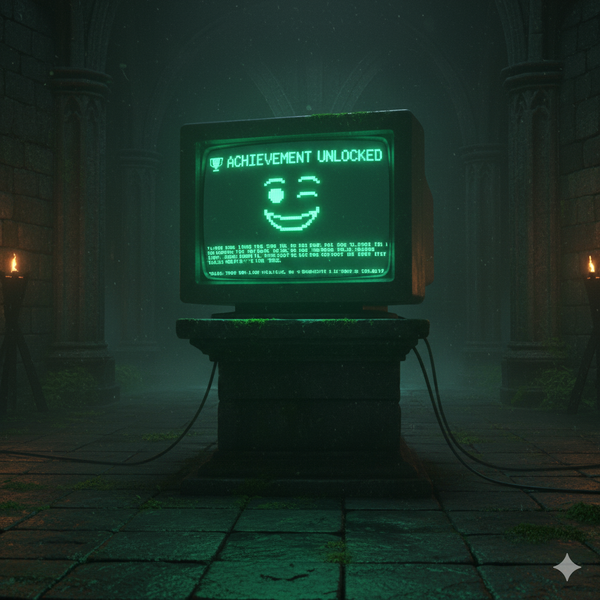

# Dungeon Master Keith (DMK)



A sarcastic AI dungeon master that runs persistent, multiplayer campaigns over Telegram.

Keith picks a genre with you, helps everyone roll up a character, then narrates the
campaign — rolling dice, handing out loot, tracking HP and XP, and remembering what
happened forty turns ago. The model doing the narrating is a config line: Claude,
OpenAI, DeepSeek, or a local model on your own hardware.

> **Status: mid-revamp.** Solo play works end to end. Long-term memory
> (summarisation), level-up choices and group play land in milestones 3–4 — see
> [Roadmap](#roadmap).

## Quickstart

```bash
uv sync --extra dev
cp .env.example .env      # fill in TELEGRAM_BOT_TOKEN and one provider key
make run
```

Then, in Telegram:

```
/newgame     pick a genre
/join        make a character
/begin       Keith opens the story
```

After that just type what you do — no command needed. `/sheet` and `/party` show
character sheets, `/endgame` retires the campaign.

`/newgame` offers the built-in genres, but you can also just type one — cyberpunk,
pirates, cosy village mystery — and the setting is generated for you, with its own
archetypes, origins and names for the six abilities. It's stored with the campaign,
so it survives restarts.

When something you attempt could fail, Keith stops and hands you the dice: a 🎲
button appears, and tapping it shows the roll, your modifier and the target number
before he narrates what it cost you. He still rolls monster attacks and damage
himself — only your own attempts are yours to roll.

**Campaigns become books.** `/chronicle` writes up everything that's happened since
the last time you asked, appends it as a new chapter, and sends you the whole thing
as a `.md` file — narrated by Keith in past tense, with the dice and hit points
stripped out and the 🏆 blocks closing each chapter. `/chronicle redo` rewrites the
most recent chapter if it came out badly.

Chapters are kept rather than regenerated, so the book grows with the campaign
instead of having to fit in one request. `/endgame` catches up and then rewrites the
whole thing knowing how it ended, which is the one moment early chapters can
foreshadow. That final pass takes a few minutes and several model calls.

It runs on `DMK_SUMMARY_MODEL`, so you can play on something cheap and fast and have
the book written by something good.

**Characters outlive campaigns.** `/export` sends you a Markdown character sheet —
readable, printable, with the exact data in a JSON block at the end. Upload it into
any other campaign and that character walks in with their level, XP, gear and
achievements intact, picking a new archetype to suit the setting. Abilities need no
conversion at all: they're stored under canonical keys and only *displayed* under a
genre's names, so a Fantasy character's Strength 16 is a cyberpunk character's
Muscle 16.

The sheet is yours to edit. The bot will notice, import it anyway, and have
something to say about it.

**Checks pay XP**, more for a hard one and something even on a failure, so
progression follows the risks you actually take. That's deliberately the engine's
job rather than the DM's: two different models each narrated a whole session —
quests, fights, disasters — without ever awarding a single point, so nobody could
level.

In a group, everyone who has run `/join` can act. If you're talking to another
player rather than to Keith, @mention them and he'll stay out of it.

## Configuration

Everything is environment variables (see [.env.example](.env.example)):

| Variable | Purpose |
| --- | --- |
| `TELEGRAM_BOT_TOKEN` | Required. From [@BotFather](https://t.me/BotFather). |
| `DMK_MODEL` | The DM's model, as `provider:model`. Default `anthropic:claude-opus-5`. |
| `DMK_SUMMARY_MODEL` | Cheap model used only to compress old transcript into the campaign summary. |
| `ANTHROPIC_API_KEY` etc. | Credentials for whichever provider you picked. Read by pydantic-ai directly. |
| `DMK_DB_PATH` | SQLite file. Default `./local/dmk.sqlite3`. |
| `DMK_EFFORT` | How hard the model thinks: `low`…`max`. Default `medium`. Anthropic only. |
| `DMK_LOG_LEVEL` | `DEBUG`, `INFO`, `WARNING`, … |

### Switching models

Change one line and restart:

```bash
DMK_MODEL=anthropic:claude-opus-5     # Claude
DMK_MODEL=openai:gpt-5                # OpenAI
DMK_MODEL=deepseek:deepseek-chat      # DeepSeek
DMK_MODEL=ollama:qwen3:14b            # local, needs OLLAMA_BASE_URL
```

Campaign history lives in our own database rather than in provider-specific message
objects, so a campaign started on Claude continues on a local model without losing
anything.

## Development

```bash
make check    # ruff + mypy + pytest
make test
make fmt
```

Layout:

```
src/
  main.py       entrypoint (python -m src.main)
  config.py     environment settings
  storage/      schema.sql + async repository (all SQL lives here)
  game/         dice, character maths, genres, memory assembly
  llm/          model factory + the DM agent and its tools
  bot/          Telegram handlers
  achievements/ registry + award rules
```

Design notes worth knowing:

- **Async all the way down.** aiosqlite and pydantic-ai are both async, and the
  Telegram application runs updates concurrently, so one player's turn never blocks
  another chat. Turns *within* a campaign are serialised by a per-campaign lock.
  Ruff's `ASYNC` rules guard against regressions here.
- **Game state changes only through tools.** Keith narrates, but HP, XP, inventory
  and story facts move only when he calls `update_hp`, `grant_xp`, `add_item`,
  `record_event` and friends. Anything he merely *says* happened is forgotten;
  anything a tool did is in the database. That is what makes the memory real.
- **The model isn't trusted with numbers.** Tools bound what they accept (XP per
  turn, item bonuses, dice size) and hand back a `ModelRetry` when a call is out of
  range, so a confused DM can't award a billion XP or a +100 sword.
- **One character per player per campaign** (`UNIQUE (campaign_id, user_id)`), which
  is what makes group play work.
- **All SQL is in `storage/repo.py`.** Everything else talks to typed dataclasses.

### What the DM sees each turn

Roughly 7k tokens, assembled in `game/memory.py`: the persona, the genre's ability
names, the achievement catalogue, the rolling campaign summary, recorded story
events, every character sheet, and the last 30 messages. Player text is flattened
to one line per message so nobody can type a fake `DM:` line into the transcript.

## Deployment

```bash
docker compose up --build -d
```

Set **one** storage variable — the host directory where the database is kept:

```bash
DMK_DB_DIR=/mnt/sata/dmk/db     # -> database at /mnt/sata/dmk/db/dmk.sqlite3
```

Compose mounts that directory at `/data` inside the container, and the image
already points `DMK_DB_PATH` there. Leave `DMK_DB_PATH` unset under Docker: any
other value writes inside the container, where the data vanishes on the next
rebuild, so the bot refuses to start rather than losing your campaign quietly.

The container runs as a non-root user, so it must run as whoever owns
`DMK_DB_DIR` on the host — set `DMK_UID` and `DMK_GID` from `id -u` / `id -g`. If
they don't match, the bot says exactly that at startup instead of failing with
SQLite's unhelpful "unable to open database file".

### Upgrading from the pre-revamp bot

The environment variables changed. Start from `.env.example` rather than editing
your old `.env`:

- `DMK_MODEL` now needs a provider prefix — a bare `gpt-4o` is rejected at startup.
- `OPENAI_API_KEY` alone is no longer enough; set the key matching your provider.
- `DMK_DEFAULT_MODE`, `DMK_PROFANITY_LEVEL`, `DMK_RATING`, `DMK_TANGENTS_LEVEL` and
  `DMK_ACHIEVEMENT_DENSITY` are gone.
- `DMK_DB_DIR`, `DMK_UID` and `DMK_GID` are new, and `DMK_DB_PATH` should be
  **removed** from a Docker `.env` — it now describes a path inside the container,
  not on the host.

The database schema is entirely new and **there is no migration** — the old one
couldn't represent more than one character per chat, which is the thing this
revamp exists to fix. The new database is a separate file (`dmk.sqlite3`) in the
same directory, so your old `main.sqlite3` is left untouched beside it.

Opening a pre-revamp database is refused outright rather than half-upgraded: both
schemas have an `achievement_grants` table with different columns, so applying the
new schema over the old one fails partway. If you point `DMK_DB_PATH` at an old
file, the bot says so and stops.

Also, for group play: turn **off** privacy mode for the bot in @BotFather, or
Telegram won't deliver ordinary messages to it and Keith will only see commands.

## Roadmap

| Milestone | Contents | Status |
| --- | --- | --- |
| M1 | Storage, config, logging, packaging, bot skeleton | ✅ done |
| M2 | DM agent + tools, `/newgame`, `/join`, solo play | ✅ done |
| M3 | Rolling summarisation, level-up choices, equipment, remaining genres | next |
| M4 | Group play: parallel creation, party-aware narration | |
| M5 | Sound cues, provider smoke tests, deploy to the server | |

Achievements arrived early with M2 — the registry was already there and Keith
awards them himself with a tool, rather than the old probabilistic router.
